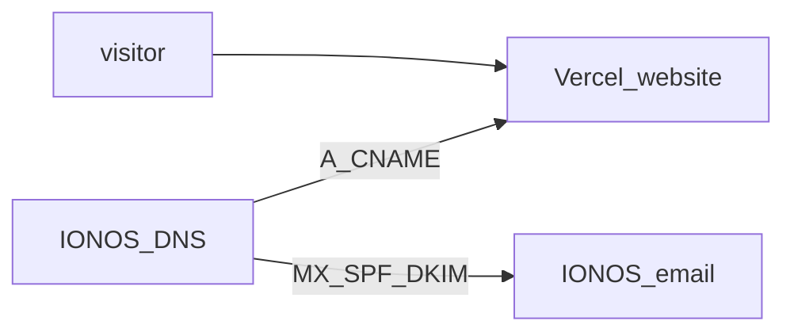

# Full exit from Hostinger → Vercel + IONOS email

Your Hostinger plan is ending. **Do not leave nameservers on Hostinger** — when hosting/DNS-parking ends, the whole domain can stop resolving (website **and** email lookups).

## Target setup

| Piece | Where it lives |
|-------|----------------|
| Website | **Vercel** |
| DNS / nameservers | **IONOS** (not Hostinger) |
| Email (`info@`) | **IONOS** mail (unchanged) |
| Hostinger | **Nothing** — cancel after cutover |

## Order of operations (do this before Hostinger expires)

### 1. Add domain in Vercel first
- Vercel project → **Settings → Domains**
- Add `aintfoundationcic.co.uk` and `www.aintfoundationcic.co.uk`
- Note the exact records Vercel shows (usually **A** `@` → `76.76.21.21` and **CNAME** `www` → `cname.vercel-dns.com`)

### 2. Switch nameservers Hostinger → IONOS
In **Hostinger** (or wherever nameservers are set for the domain):

1. Find **Nameservers** for `aintfoundationcic.co.uk`
2. Change from Hostinger (`hermes.dns-parking.com` / `artemis.dns-parking.com`) to **IONOS default nameservers**  
   (IONOS panel shows them under Domain → Nameserver — typically like `ns1026.ui-dns.*` / `ns1045.ui-dns.*` etc. Copy the exact values IONOS gives you.)
3. Save. Propagation: often 1–24 hours (can be up to 48h)

When this completes, **IONOS DNS becomes active** (the warning “custom name server” goes away).

### 3. Configure IONOS DNS (website + keep email)

In **IONOS → Domains → aintfoundationcic.co.uk → DNS** (now active):

**Keep / ensure these email records exist:**

| Type | Host | Value |
|------|------|--------|
| MX | `@` | `mx00.ionos.co.uk` (priority 10) |
| MX | `@` | `mx01.ionos.co.uk` (priority 20) |
| TXT | `@` | `v=spf1 include:_spf-eu.ionos.com ~all` |
| CNAME | `_dmarc` | `dmarc.ionos.co.uk` (or keep your DMARC TXT if preferred) |
| CNAME | `s1-ionos._domainkey` | `s1.dkim.ionos.com` |
| CNAME | `s2-ionos._domainkey` | `s2.dkim.ionos.com` |
| CNAME | `autodiscover` | IONOS autodiscover value |

**Replace Hostinger/MyWebsite web records with Vercel:**

| Action | Record |
|--------|--------|
| **Remove** any A/AAAA/CNAME/ALIAS pointing `@` or `www` at Hostinger CDN or IONOS MyWebsite | e.g. old A `217.160.*`, `www` A, Hostinger `cdn.hstgr.net` |
| **Add** Vercel **A** for `@` | value from Vercel UI |
| **Add** Vercel **CNAME** for `www` | value from Vercel UI |

Do **not** reset DNS to defaults after you have set Vercel + mail correctly.

### 4. Verify
1. Vercel domain shows **Valid** / SSL issued  
2. `https://aintfoundationcic.co.uk` loads the Next.js site  
3. Send a test email **to** `info@aintfoundationcic.co.uk` from Gmail/etc.  
4. CarePatron booking links still open  

### 5. Cancel Hostinger
Only after steps 2–4 work:

- Cancel Hostinger hosting plan  
- You do **not** need Hostinger DNS, CDN, or email  
- Domain can stay registered wherever it is (IONOS or Hostinger registrar) — if the **domain registration** itself is at Hostinger, renew/transfer the domain to IONOS before that registration expires (separate from hosting)

## What not to do
- Do not wait until Hostinger is already expired to move nameservers  
- Do not delete MX/SPF/DKIM  
- Do not leave `@` / `www` pointing at `cdn.hstgr.net`  
- Do not manage DNS in both panels at once — after NS switch, **only IONOS DNS** matters  

## Checklist
- [ ] Domain added in Vercel  
- [ ] Nameservers set to IONOS  
- [ ] IONOS DNS: Vercel A + www CNAME  
- [ ] IONOS DNS: MX + SPF + DKIM still present  
- [ ] Site + email tested  
- [ ] Hostinger hosting cancelled  
